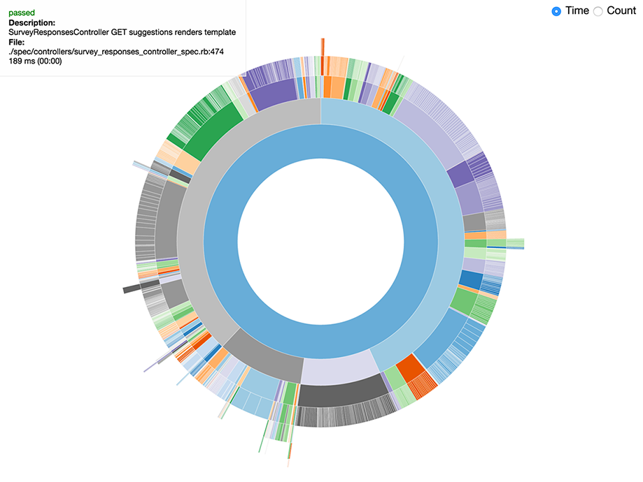

# RSpectacles

RSpectacles is an in-browser visualizer and profiler for RSpec. It uses d3.js to render a
[partition](http://bl.ocks.org/mbostock/4063423) of your specs based on time to complete, so
that you can tell at a glance where the time is spent in your test suite.

As a Sinatra app it can be run standalone, or else mounted on another Rack app.

## Compatibility

RSpectacles assumes you are using rspec 3 or later.

## Installation

    gem install rspectacles

Or in your Gemfile:

    group :test, :development do
      gem 'rspectacles'
    end

Then add the formatter to your .rspec file:

    --require rspectacles/formatter/batched
    --format RSpectacles::Formatter::Batched

    --format progress # or whatever other formatters you want to use

The formatter assumes you are using RSpec3.

## Batched Formatter

The `Batched` formatter is preferred, as it will send fewer web requests and will be less likely to
slow down your specs if the connection to the server is slow. You can change the batch
sizes by changing the `batch_size` in config settings.

## Storage

RSpectacles depends on ActiveRecord for persistence. You
can quickly get an instance up and running by setting the `DATABASE_URL` environment variable,
and running the standard rake commands:

    export DATABASE_URL=postgres://...
    rake db:create
    rake db:migrate

Start the server and connect to it in your browser:

    rackup

Then run your specs and watch the magic happen!

## Web Server

The server uses ActiveRecord and Postgres to store the examples.

Run migrations:

    # set ENV['DATABASE_URL'] to point to your database, or else database.yml defaults will be used
    rake db:create
    rake db:migrate

Start the server:

    puma

## Configuration

Configuration settings can all be set through environment variables:

    # client settings
    RSPECTACLES_URL # where server is running
    RSPECTACLES_RUN_KEY # set to log parallel builds to same report
    RSPECTACLES_BATCH_SIZE = 1000
    RSPECTACLES_TIMEOUT = 15

## Contributing

1. Fork it
2. Create your feature branch (`git checkout -b my-new-feature`)
3. Commit your changes (`git commit -am 'Added some feature'`)
4. Push to the branch (`git push origin my-new-feature`)
5. Create new Pull Request
